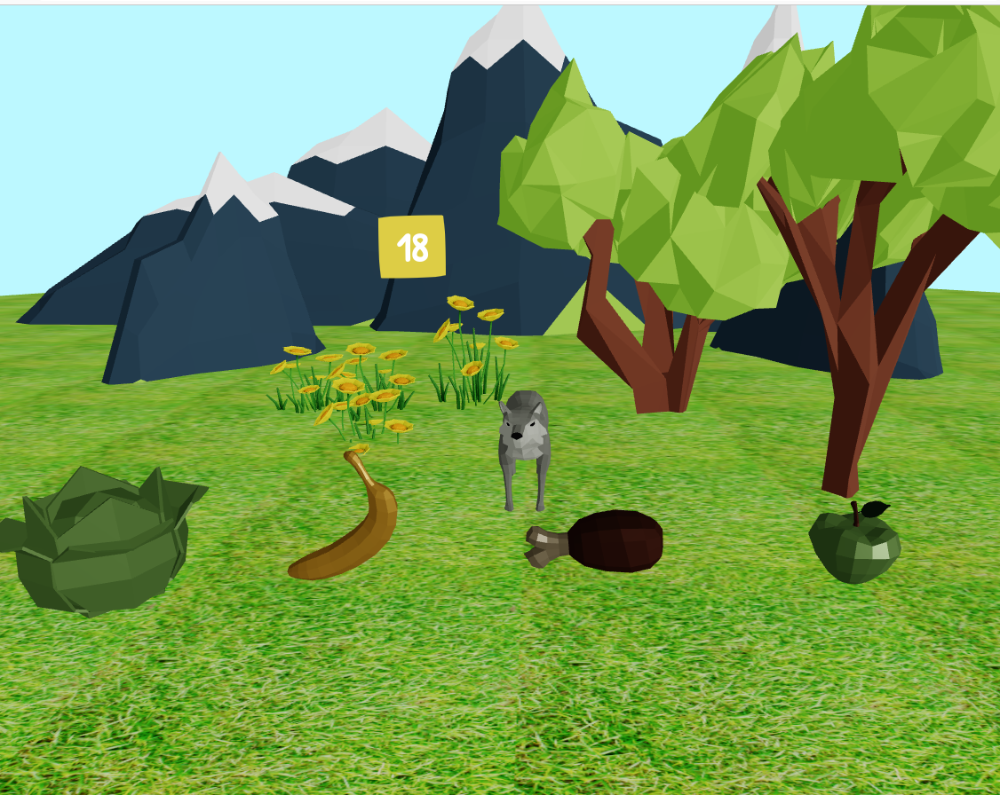

# GAME -> Feed the animal
A simple game with start menú, and two options when playing to feed the animal. 
Download the repo and then install de dependencies.

```
npm install
```

## Frameworks included

---
**CSS**
Get paper CSS provides a friendly components

[PaperCSS](https://www.getpapercss.com/)  
[PaperCSS_Repo](https://github.com/papercss/papercss  )  

---
**3D Images**
Poly Pizza has a lot of different ·D images. Download as a GLF or GLTF.
After that, is needed to convert and create JSX element, with the next command:

```
npx gltfjsx ./public/models/examples.glf
```

https://poly.pizza/  
[Poly_Pizza](https://poly.pizza/)  

This project are using the **Ultimate Food Pack by Quaternius via Poly Pizza**  

[Ultimate Food Pack](https://poly.pizza/bundle/Ultimate-Food-Pack-h3WC1gyRb4)

---
Previews

